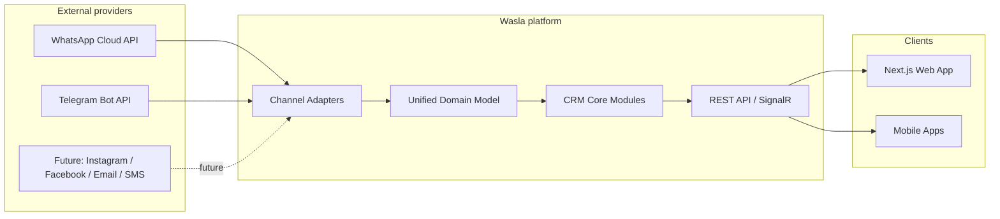
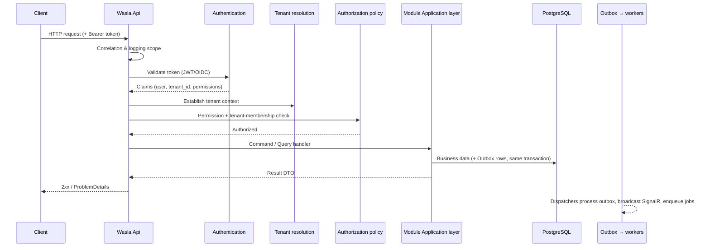

# Wasla — Architecture

> **One Inbox. Every Conversation.**

This document defines the architecture of Wasla: a production-grade, multi-tenant,
omnichannel CRM SaaS platform. It is the top-level reference; deeper topics live in
the companion documents linked throughout and in the
[ADR set](decisions/README.md).

---

## 1. Purpose and scope

Wasla connects businesses with their customers across multiple communication channels
(WhatsApp, Telegram, Instagram, Facebook, Email, SMS) and unifies every conversation
into a single agent workspace, backed by a Customer 360 profile.

Scope of this document:

- System context and architectural principles
- The modular monolith approach and extraction seams
- Module catalog, boundaries, and dependency rules
- Solution structure
- Composition, request pipeline, and cross-cutting concerns
- Data ownership rules
- Quality attributes and verification strategy

Out of scope: low-level implementation detail (Phase 1+) and feature specifications for
post-MVP modules (Campaigns, Automation, Bot Builder, Commerce, Billing, AI).

---

## 2. System context



Wasla Core knows what a conversation, customer, message, team, ticket and task are —
but it does **not** know whether a message came from WhatsApp, Telegram, Instagram,
Facebook, Email or SMS. Provider-specific complexity belongs at the edges, inside
channel adapters ([ADR-0005](decisions/0005-channel-adapter-abstraction.md)).

---

## 3. Architectural principles

1. **Modular monolith first.** One deployable process with strict internal module
   boundaries; no microservices initially ([ADR-0001](decisions/0001-modular-monolith-first.md)).
2. **Provider isolation.** No provider SDK type may appear outside channel adapters;
   the domain and application layers speak only the normalized internal model.
3. **Multi-tenant by construction.** Every tenant-owned row carries `TenantId`; tenant
   isolation is enforced in layers (routing, authorization, persistence, tests), never
   by a single check ([ADR-0002](decisions/0002-multi-tenancy-shared-schema.md)).
4. **Correctness under failure.** Outbox + Inbox patterns, idempotent consumers,
   at-least-once delivery semantics with explicit deduplication
   ([ADR-0004](decisions/0004-outbox-inbox-background-workers.md)).
5. **Observable by default.** Structured logs, metrics, traces, correlation IDs, and
   health checks from day one (§32, §62 of the product specification).
6. **Frontend-agnostic.** Clean versioned REST API (`/api/v1`) and SignalR hubs; the
   backend never assumes a specific UI. DTOs only — EF entities never leave the process.
7. **Simple > clever.** Production-grade solutions that a normal .NET team can operate;
   no abstractions without a concrete justification.

---

## 4. Modular monolith

### 4.1 Why a monolith

- The product domain is highly cohesive: inbox, customers, channels, and messaging
  share transactional workflows (message ingestion touches customers, conversations,
  messages, notifications).
- A distributed system at this stage would multiply operational cost (deploys, tracing,
  consistency) without corresponding scale benefits.
- The team can ship faster with a single build/test/deploy pipeline.

### 4.2 Extraction seams

The monolith is designed so any module can later be extracted into a service without
rewriting its internals:

| Seam | Mechanism |
|------|-----------|
| Code boundaries | Modules communicate only via public **contracts** and **integration events**; no direct internal references |
| Data ownership | Each module owns its PostgreSQL schema and DB context; no cross-module foreign keys or joins |
| Messaging | Integration events flow through per-module **Outbox** tables; consumers are decoupled |
| API surface | HTTP endpoints are thin; application commands/queries are the unit of work |
| Processes | Background jobs are module-scoped; a worker pool can be split per module |
| Configuration | Each module declares its own strongly-typed options |

Extraction = replace in-process contract calls with HTTP/gRPC adapters, move the schema,
and run the module's workers separately. No domain model changes.

---

## 5. Module catalog

Modules map to bounded contexts. MVP modules are implemented through the Phase plan
(see [roadmap.md](roadmap.md)); post-MVP modules exist as folders and ADR-level
extension points only.

| Module | Responsibility (owns) | MVP |
|--------|----------------------|-----|
| **Tenancy** | Tenant lifecycle, tenant settings, tenant resolution support | ✅ |
| **Identity** | Users, memberships (user↔tenant), roles, permissions, authentication (JWT/OIDC), authorization policies | ✅ |
| **Teams** | Teams, team membership, team roles; assignment targets for conversations/tickets | ✅ |
| **Customers** | Customer 360: customer, identities, contacts, tags, notes, activities, identity resolution | ✅ |
| **Conversations** | Conversation lifecycle: status, priority, assignment, tags, internal notes, mentions, quick replies, conversation timeline, unread counters | ✅ |
| **Messages** | Message store and pipeline: normalized messages, statuses, attachments (MediaFile metadata), idempotent ingestion | ✅ |
| **Channels** | Channel accounts (tenant's provider connections), channel adapters, outbound send pipeline, inbound normalization orchestration | ✅ |
| **Tickets** | Tickets linked to customers/conversations, SLA-ready fields | ✅ |
| **Tasks** | Trello-style boards, columns, tasks, labels, comments, attachments | ✅ |
| **Notifications** | In-app + email notifications; notification preferences | ✅ |
| **Analytics** | Event-sourced metrics & rollups: volumes, response times, resolution times, agent performance | ✅ (basic) |
| **Audit** | Append-only audit log of security-relevant actions | ✅ |
| **Automation** | Trigger → conditions → actions engine | ⛔ Post-MVP |
| **Campaigns** | Bulk messaging campaigns, audiences, templates, consent | ⛔ Post-MVP |
| **Billing** | Plans, subscriptions, entitlements (limits) | ⛔ Post-MVP |
| **Bot Builder** *(inside Automation folder later if needed)* | Visual bot flows; immutable published versions | ⛔ Post-MVP |
| **Commerce** *(separate module when built)* | Products, orders, payments behind provider abstractions | ⛔ Post-MVP |

Note: the product specification lists the same module set; Bot Builder and Commerce are
future modules and will be added following the same structure when scheduled.

---

## 6. Module boundaries and dependency rules

### 6.1 Allowed dependencies

| Layer | May reference |
|-------|----------------|
| `X.Domain` | BuildingBlocks primitives only. No Application, no Infrastructure, no other module, no external frameworks |
| `X.Application` | own `X.Domain`, own `Contracts` namespace, BuildingBlocks abstractions, **other modules' `Contracts` only** |
| `X.Infrastructure` | own `X.Application` + `X.Domain`, BuildingBlocks infrastructure, provider SDKs (only inside Channels adapters), EF Core, Redis client |
| `Wasla.Api` (Host) | everything — it is the composition root |
| Tests | anything (test projects are not bound by runtime rules, but architecture tests assert the rules above) |

Rules:

- **No cross-module internals.** Referencing another module's `Domain` or
  `Infrastructure` is forbidden. Cross-module communication uses the other module's
  `Contracts` (public application interfaces + DTOs) or integration events.
- **No shared "service layer" project.** Shared code lives in BuildingBlocks only when
  it is genuinely cross-cutting (primitives, abstractions, web helpers). BuildingBlocks
  contains **no business logic**.
- **Provider SDK isolation.** Meta/WhatsApp/Telegram/Twilio/SendGrid-style packages may
  be referenced only by `Wasla.Channels.Infrastructure` (adapter implementations).
  Architecture tests enforce this.
- **Contracts are versioned and stable.** They are the module's public API; changing
  them follows the same discipline as public HTTP APIs.

### 6.2 Communication patterns between modules

| Pattern | When | Example |
|---------|------|---------|
| Contract call (read) | Synchronous read needing immediate result | `ICustomerDirectory.GetSummaryAsync(customerId)` used by Conversations |
| Contract call (write orchestration) | Synchronous write where the initiator needs to control flow and idempotency | Messages ingestion calls Conversations `GetOrCreateActiveConversation` |
| Integration event (outbox) | Side effects that can be eventual | `MessageReceived` → Notifications, Analytics, Conversations counters |
| Domain event (in-process) | Inside one module, same transaction scope | `Conversation.Resolved` → internal audit of timeline entry |

Cross-module reads that would require joining data owned by another module (e.g. inbox
list showing customer name + channel label) are served via:

1. **Batched contract reads** (e.g. resolve a page of IDs to labels in one call), or
2. **Local read-model projections** maintained from integration events when the read is
   hot and join-heavy (e.g. Analytics counters).

Direct cross-module SQL joins are forbidden. This preserves data ownership and keeps
future extraction realistic.

---

## 7. Solution structure

```text
Wasla/
├── Wasla.sln
├── docs/                                    # this documentation set
├── src/
│   ├── Wasla.Api/                           # HTTP host & composition root
│   │   ├── Endpoints/                       # minimal API endpoint modules (per module)
│   │   ├── Program.cs
│   │   └── appsettings*.json
│   ├── Wasla.BuildingBlocks/                # shared kernel (no business logic)
│   │   ├── Domain/                          # Entity, AggregateRoot, ValueObject, IDs, events
│   │   ├── Application/                     # CQRS abstractions, validation, results
│   │   ├── Infrastructure/                  # Clock, Outbox infra, jobs, storage, cache
│   │   └── Web/                             # ProblemDetails, auth policy infra, rate limiting
│   └── Modules/
│       ├── Tenancy/    { Wasla.Tenancy.Domain, .Application, .Infrastructure }
│       ├── Identity/   { ... }
│       ├── Teams/      { ... }
│       ├── Customers/  { ... }
│       ├── Conversations/ { ... }
│       ├── Messages/   { ... }
│       ├── Channels/   { ... }              # adapters live in .Infrastructure/Channels/
│       ├── Tickets/    { ... }
│       ├── Tasks/      { ... }
│       ├── Notifications/ { ... }
│       ├── Analytics/  { ... }
│       ├── Audit/      { ... }
│       ├── Automation/ { ... }              # post-MVP
│       ├── Campaigns/  { ... }              # post-MVP
│       └── Billing/    { ... }              # post-MVP
└── tests/
    ├── Wasla.UnitTests/
    ├── Wasla.IntegrationTests/
    └── Wasla.ArchitectureTests/
```

Conventions:

- Project per layer per module: `Wasla.<Module>.Domain`, `Wasla.<Module>.Application`,
  `Wasla.<Module>.Infrastructure`. Public contracts live in
  `Wasla.<Module>.Application/Contracts/` and are treated as the module's public API.
- `Wasla.Api` references every module project; modules never reference `Wasla.Api`.
- Test projects: unit (pure), integration (Testcontainers: PostgreSQL + Redis), and
  architecture tests (dependency rules, provider isolation, namespace rules).

Exact project files, package versions and build wiring are delivered in Phase 1
(Foundation).

---

## 8. Composition and hosting

- **One ASP.NET Core host** (`Wasla.Api`) composes all modules and hosts both HTTP
  endpoints and background workers in the same process (MVP). Worker hosting will be
  split-capable later via configuration (run API-only vs worker-only modes).
- **Module registration pattern.** Each module exposes an `IModule` implementation:

  ```csharp
  public interface IModule
  {
      void RegisterServices(IServiceCollection services, IConfiguration configuration);
      void MapEndpoints(IEndpointRouteBuilder endpoints);
  }
  ```

  The host discovers registered modules and calls each in order. Adding a module is
  additive; removing a module does not break others.

- **Configuration** is strongly typed (§44 of the spec): one options class group per
  module/feature (`DatabaseOptions`, `RedisOptions`, `StorageOptions`, `JwtOptions`,
  `WhatsAppOptions`, `TelegramOptions`, ...). Raw `IConfiguration["string:paths"]`
  access is banned outside composition code.
- **Dependency injection** is the only service-location-like mechanism; no static
  service locators.

---

## 9. Request pipeline



Pipeline guarantees:

- **Tenant context** is established from the authenticated token only — never from
  request bodies or query strings.
- **Validation** (FluentValidation) runs before handlers; failures produce RFC 9457
  `ProblemDetails` with `application/problem+json`.
- **Errors** are translated centrally into `ProblemDetails`; internal exceptions never
  leak ([api.md](api.md)).
- **Idempotency** headers are honored on non-idempotent sends (`Idempotency-Key`).
- **Correlation & tracing** identifiers are attached to every log entry, trace, and
  error response (`traceId`).

---

## 10. Data ownership and persistence

- **One PostgreSQL database** (MVP), organized into **one schema per module**
  (`tenancy`, `identity`, `teams`, `customers`, `conversations`, `messages`,
  `channels`, `tickets`, `tasks`, `notifications`, `analytics`, `audit`).
- **One EF Core `DbContext` per module**; each context owns its schema and its own
  migrations history. No context reads another module's tables.
- **No cross-module foreign keys.** Entities reference foreign IDs (UUID) logically;
  referential consistency across modules is maintained by application logic and events.
  FKs inside a module schema are enforced normally.
- **Outbox per module**: `outbox_messages` table inside each module schema, written in
  the same transaction as business data; a dispatcher drains it.
- **IDs**: UUIDv7 (time-ordered) for entity primary keys — index locality without
  identity gaps, safe for future distributed generation.
- Details, ERD, and index strategy: [database.md](database.md).

---

## 11. Cross-cutting concerns

| Concern | Approach | Reference |
|---------|----------|-----------|
| Multi-tenancy | Tenant context + EF global filters + SaveChanges guards + authorization + tests; optional RLS hardening | [multi-tenancy.md](multi-tenancy.md) |
| Security | JWT/OIDC, refresh rotation, permission-based policies, rate limiting, secrets from env/secret manager | [security.md](security.md) |
| Real-time | SignalR hubs with tenant-scoped groups; events mapped to typed client messages | [events.md](events.md), [ADR-0006](decisions/0006-signalr-tenant-scoped-realtime.md) |
| Background work | DB outbox dispatchers + Redis-backed job queue for ephemeral fan-out; retries with backoff; dead-letter | [events.md](events.md) |
| Webhooks | Thin, fast, verified, idempotent ingress; heavy work queued | [webhooks.md](webhooks.md) |
| Media | S3-compatible object storage; PostgreSQL stores metadata only; validation + scanning hook | [ADR-0008](decisions/0008-s3-compatible-media-storage.md) |
| Search | PostgreSQL FTS + pg_trgm behind a search abstraction | [database.md](database.md), [ADR-0010](decisions/0010-postgres-fulltext-search-first.md) |
| Observability | Serilog structured logs, OpenTelemetry traces/metrics, health checks | [deployment.md](deployment.md) |
| Localization | Culture-aware formatting; user-facing strings localized; RTL-ready API contract (no UI strings in backend business logic) | [api.md](api.md) |
| Feature flags | Capability abstraction evaluated per tenant/plan (`instagram`, `campaigns`, `bots`, ...) | [security.md](security.md) |

---

## 12. Quality attributes and performance principles

- **No N+1 queries** — projections for list screens, explicit `Include` only when
  needed, query-level review culture; integration tests assert query counts on hot paths.
- **Async I/O everywhere**; `CancellationToken` flows through all layers.
- **Pagination is mandatory** for all collections; cursor-based for message streams.
- **Measure before optimizing** — OpenTelemetry metrics and DB telemetry guide tuning.
- **Connection pooling** (Npgsql pooling) and Redis caching where it demonstrably helps
  (dashboard counts, permission sets), never as a source of truth.
- **Efficient SignalR fan-out** — broadcast to the narrowest group; never tenant-wide
  when user-scoped delivery suffices.
- **SQL-first search** until proven insufficient; the search port allows a dedicated
  engine later without domain changes.

---

## 13. Verification strategy

Every phase ships with tests (see [development.md](development.md) for the full
strategy). Architecture-level guarantees are enforced automatically:

- **Architecture tests** assert: Domain ⟂ Infrastructure; Application ⟂ Host; module
  internals are not referenced cross-module; provider SDK references exist only in
  Channels infrastructure.
- **Tenant isolation suite** (mandatory, §48 of spec): a request authenticated for
  Tenant A must never read or mutate Tenant B data — positive and negative cases across
  every endpoint family.
- **Integration tests** for webhooks (signature, replay, duplicate delivery),
  message pipeline idempotency, outbox dispatch, and authorization policies.

---

## 14. ADR index

| ADR | Decision |
|-----|----------|
| [0001](decisions/0001-modular-monolith-first.md) | Modular monolith first (extraction-ready) |
| [0002](decisions/0002-multi-tenancy-shared-schema.md) | Multi-tenancy: shared DB/schema, TenantId + defense in depth |
| [0003](decisions/0003-postgresql-source-of-truth-redis-cache-queues.md) | PostgreSQL is source of truth; Redis for cache/queues/ephemeral state |
| [0004](decisions/0004-outbox-inbox-background-workers.md) | Outbox + Inbox patterns with background workers |
| [0005](decisions/0005-channel-adapter-abstraction.md) | Channel adapter abstraction and provider isolation |
| [0006](decisions/0006-signalr-tenant-scoped-realtime.md) | SignalR with tenant-scoped groups |
| [0007](decisions/0007-authn-jwt-oidc-permission-authorization.md) | JWT/OIDC authentication + permission-based authorization |
| [0008](decisions/0008-s3-compatible-media-storage.md) | S3-compatible media storage; metadata only in PostgreSQL |
| [0009](decisions/0009-ddd-cqrs-lite-and-testing-strategy.md) | DDD boundaries, CQRS-lite, and the testing strategy |
| [0010](decisions/0010-postgres-fulltext-search-first.md) | PostgreSQL full-text search first behind a search port |
