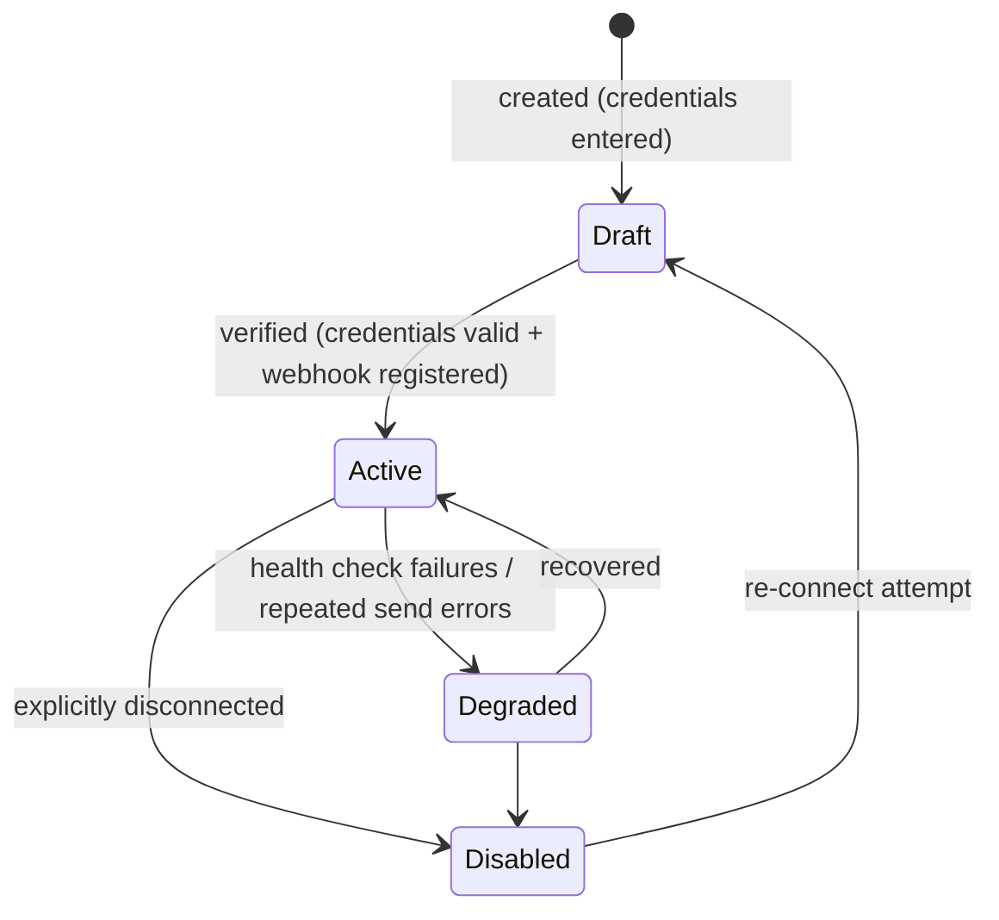
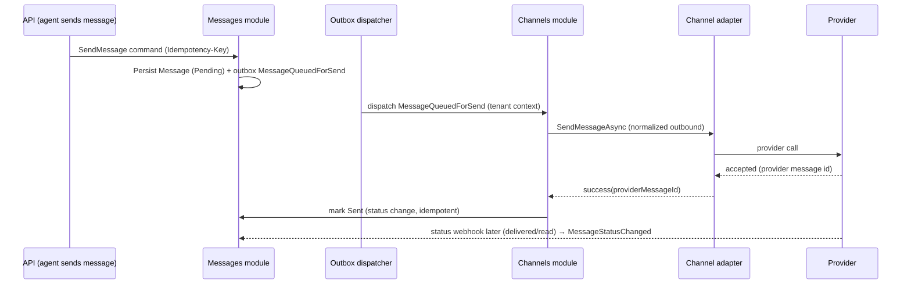

# Wasla — Channel Architecture

The channel abstraction is one of the most important architectural requirements of
Wasla (§10 of the specification): provider-specific complexity must never leak into the
core CRM domain.

Related: [ADR-0005](decisions/0005-channel-adapter-abstraction.md),
[webhooks.md](webhooks.md), [domain-model.md §10](domain-model.md#10-channels-module).

---

## 1. The rule

> Wasla Core knows what a conversation, customer, message, team, ticket and task are —
> but it must NOT know whether a message came from WhatsApp, Telegram, Instagram,
> Facebook, Email or SMS.

Concretely:

- No Meta/Telegram/Twilio/SendGrid SDK type may appear in any `Domain` or
  `Application` project. Provider packages are referenced **only** by
  `Wasla.Channels.Infrastructure` (adapters).
- The domain speaks only the normalized model (`Message`, `MessageType`, `Direction`,
  statuses) from [domain-model.md](domain-model.md#9-messages-module).
- Architecture tests enforce this (namespace/package rules).

---

## 2. The abstraction

Interfaces live in `Wasla.BuildingBlocks.Application.ChannelAdapters` (hoisted from the Channels module in Phase 5 so Messages can dispatch without referencing Channels - see ADR-0011); implementations in
`Wasla.Channels.Infrastructure/Adapters/<Provider>/`.

```csharp
public interface IChannelAdapter
{
    ChannelType ChannelType { get; }

    ChannelCapabilities Capabilities { get; }

    /// Verify authenticity of an inbound webhook (signature/secret, size, replay).
    Task<WebhookVerificationResult> VerifyWebhookAsync(
        ChannelWebhookContext context,
        CancellationToken cancellationToken);

    /// Map provider payloads to normalized inbound events (no domain side effects).
    Task<IReadOnlyList<NormalizedInboundEvent>> NormalizeInboundAsync(
        ChannelWebhookContext context,
        CancellationToken cancellationToken);

    /// Send a text/interactive message to the provider.
    Task<ChannelSendResult> SendMessageAsync(
        ChannelOutboundMessage message,
        CancellationToken cancellationToken);

    /// Send a media message (image/video/audio/document) to the provider.
    Task<ChannelSendResult> SendMediaAsync(
        ChannelOutboundMediaMessage message,
        CancellationToken cancellationToken);
}
```

Supporting types (sketch — final shapes locked in Phase 5/6 against real provider
constraints, changes stay inside Contracts):

| Type | Purpose |
|------|---------|
| `ChannelWebhookContext` | Raw request essentials (body bytes, headers subset, channel, receivedAt) — raw body required for signature checks |
| `WebhookVerificationResult` | Valid/invalid + reason + replay window info |
| `NormalizedInboundEvent` | One of: `InboundMessage`, `MessageStatusUpdate`, `ChannelHealthEvent` — provider-independent fields only |
| `ChannelOutboundMessage` | TenantId, ChannelId, recipient identity, body, type, reply-to, idempotency hints |
| `ChannelOutboundMediaMessage` | Media reference (MediaFile id + storage key + content type), caption |
| `ChannelSendResult` | Success + `ProviderMessageId` + provider raw code, or Failure(kind: Transient, RateLimited(retryAfter), Rejected(code), Invalid) |
| `ChannelCapabilities` | Flags: supportsDeliveryReceipts, supportsReadReceipts, supportsTyping, supportsTemplates, supportsMedia, maxTextLength, ... |

**Registry**: `IChannelAdapterRegistry.Resolve(ChannelType)` — the pipeline (outbound
send consumer, webhook processor) resolves the adapter and never switches on provider
strings outside the registry.

---

## 3. Channel lifecycle



- **Connect** (WhatsApp/Telegram): operator provides provider credentials (Cloud API
  token + phone number id + app secret; bot token). Wasla verifies by calling the
  provider (e.g. getMe / phone number fetch), registers/refreshes webhooks, and
  transitions the channel to `Active`.
- **Verify** background job re-checks periodically (`LastHealthCheckAt`); repeated
  failures → `Degraded` (sends paused? no — sends attempt and report; degraded surfaces
  incident status) + notification to admins.
- **Disconnect**: unregisters provider webhook where supported, drops credential
  material, keeps historical messages/conversations intact.

---

## 4. Outbound flow



Rules:

- Sends are executed by workers, never inline with HTTP requests.
- **Uncertain outcomes are not blind-retried**: if the provider call times out without
  an accepted id, the message enters `Failed` (with `Unknown` outcome reason) and is
  reconciled by status webhooks; automatic re-send happens only when the provider
  guarantees idempotent send semantics (capability flag). This is deliberate: no
  duplicate customer messages.
- Per-channel outbound throttling respects provider rate limits (token bucket per
  channel, powered by Redis).
- Provider rejection (e.g. WhatsApp 24-hour window / policy) maps to a **permanent**
  failure with a user-readable reason; the agent UI offers template alternatives later.

---

## 5. Inbound flow

Defined in [webhooks.md](webhooks.md). Responsibilities split:

- The **endpoint** is provider-neutral (size limit, persist raw, enqueue).
- The **adapter** verifies signatures and normalizes payloads — it produces
  `NormalizedInboundEvent`s only.
- The **pipeline** (Channels application layer) applies normalized events through
  module contracts (Messages/Conversations/Customers), with deduplication and
  tenant context; domain side effects happen only there.

---

## 6. Provider mapping tables

### 6.1 WhatsApp Cloud API → normalized model

| Provider field | Normalized |
|----------------|-----------|
| `metadata.phone_number_id` | channel `ExternalAccountId` (sanity check, must match) |
| `messages[].id` | `ProviderMessageId` |
| `messages[].from` | `CustomerIdentity(ChannelType=WhatsApp, ExternalId=E.164)` |
| `messages[].timestamp` | `SentAt` |
| `messages[].text.body` | `Body`, `Type=Text` |
| `messages[].image/video/audio/document/sticker` | `Type=Image/Video/Audio/Document/Sticker`; provider `media.id` downloaded by adapter → `MediaFile` |
| `messages[].location` | `Type=Location` (+ coordinates in `ProviderMetadata`) |
| `messages[].contacts` | `Type=Contact` |
| `messages[].interactive/button` | `Type=Interactive` (reply ids preserved in `ProviderMetadata`) |
| `messages[].context.id` | reply-to provider id (threading) |
| `statuses[].id` + `status` (sent/delivered/read/failed) | `MessageStatusChanged` (monotonic) |
| `statuses[].errors[]` | failure code/reason → `MessageFailed` |

### 6.2 Telegram Bot API → normalized model

| Provider field | Normalized |
|----------------|-----------|
| `message.message_id` | `ProviderMessageId` |
| `message.chat.id` / `from.id` | `CustomerIdentity(ChannelType=Telegram, ExternalId=chat id)` (+ username in metadata) |
| `message.date` | `SentAt` |
| `message.text` / `caption` | `Body`, `Type=Text` / media caption |
| `message.photo/document/voice/audio/video/sticker` | `Type=Image/Document/Audio/Video/Sticker`; download via `getFile` → `MediaFile` |
| `message.location/contact` | `Type=Location/Contact` |
| `message.reply_to_message` | reply reference |
| `callback_query` | `Type=Interactive` (callback data preserved) |
| (Telegram bots receive limited receipt info) | statuses typically stop at `Sent`; capability flag `supportsDeliveryReceipts=false` |

Media download note: adapters fetch provider media (with size caps), store via the
`IFileStorage` port into tenant-prefixed keys, and hand `MediaFile` metadata to the
Messages module (§22; validation + scan status apply).

---

## 7. Provider metadata passthrough

- Provider-specific extras are stored in `Message.ProviderMetadata` (JSONB) **exactly
  as normalized by the adapter**, with a `schemaVersion`.
- The core never parses `ProviderMetadata`; only adapter code (and future
  provider-aware features) may read it.
- Additive changes only; breaking changes bump `schemaVersion`. This preserves provider
  information without leaking provider concepts into the domain (§11 of spec).

---

## 8. Error taxonomy (outbound)

| Kind | Meaning | Handling |
|------|---------|----------|
| `Transient` | Network/5xx/unknown | Retry with backoff (outbox attempts); still idempotency-guarded |
| `RateLimited` | Provider throttled (429 etc.) | Retry after `retryAfter`; channel token bucket eases off |
| `Rejected` | Provider policy/business rejection (24h window, blocked user, template required) | Permanent failure; surfaced to agent with reason code |
| `Invalid` | Malformed request (bug) | Permanent; logged with correlation; alert if rate spikes |

---

## 9. MVP adapters — explicit scope

| Adapter | Scope |
|---------|-------|
| **WhatsApp** | **Official WhatsApp Cloud API only.** Explicitly **not** unofficial scraping or reverse-engineered protocols (per spec Phase 5). Templates for outside-24-hour-window sends. |
| **Telegram** | Bot API via webhook (`setWebhook` + secret token). |

Future adapters (Instagram, Facebook, Email, SMS) implement the same interfaces; the
registry and pipeline require no core changes. Email/SMS bring their own inbound
mechanisms (IMAP/inbound parse, SMS provider webhooks) — normalized the same way.

---

## 10. Testing expectations (per adapter)

- **Fixture replay tests**: recorded (anonymized) provider payloads → verify signature
  → normalize → assert normalized output (goldens committed).
- **Idempotency tests**: duplicate deliveries produce single domain effects.
- **Outbound mapping tests**: outbound model → provider request body fixtures.
- Adapter tests are the only place provider fixtures may include provider field names.
