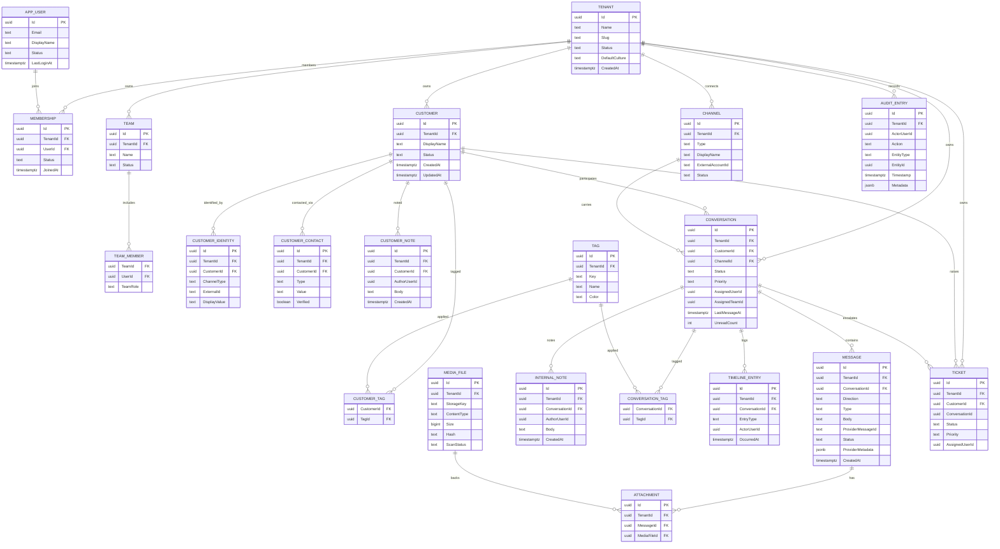

# Wasla — Database Model

PostgreSQL is the **single source of truth** ([ADR-0003](decisions/0003-postgresql-source-of-truth-redis-cache-queues.md)).
This document covers the relational model, conventions, constraints, indexing strategy,
search, migrations, and retention. Entity semantics are defined in
[domain-model.md](domain-model.md).

---

## 1. Conventions

| Topic | Decision |
|-------|----------|
| Database | One PostgreSQL database (MVP); one **schema per module**: `tenancy`, `identity`, `teams`, `customers`, `conversations`, `messages`, `channels`, `tickets`, `tasks`, `notifications`, `analytics`, `audit` |
| Ownership | One EF Core `DbContext` per module owns its schema; no context touches another module's tables |
| Primary keys | `uuid` (UUIDv7, time-ordered) |
| Tenant column | `TenantId uuid NOT NULL` on every tenant-owned table; part of unique keys and leading index column |
| Naming | EF Core default mapping (quoted PascalCase identifiers). Revisit only with a concrete operational need |
| Timestamps | `timestamptz` in UTC; `CreatedAt`, `UpdatedAt` maintained in application layer |
| Enums | Stored as text with check constraints (readable in SQL; migrations for new values are explicit) |
| JSON | `jsonb` for extensible provider metadata, payloads, and audit details |
| FKs | Enforced **within a module schema**; **no cross-module foreign keys** (referenced ids are logical UUIDs) |
| Soft delete | Only where domain requires (`customers.ArchivedAt`, tags/labels `ArchivedAt`); messages are append-only |
| Concurrency | PostgreSQL `xmin` used as optimistic concurrency token (EF Core Npgsql `UseXminAsConcurrencyToken`) on mutable aggregates |

---

## 2. ERD (MVP core)



(Additional MVP tables not shown: `identity.Roles`, `identity.MembershipRoles`,
`identity.RefreshTokens`, `conversations.QuickReplies`, `tasks.Boards`,
`tasks.BoardColumns`, `tasks.TaskCards`, `tasks.TaskComments`, `tasks.TaskLabels`,
`tasks.TaskAssignees`, `tasks.TaskAttachments`, `notifications.Notifications`,
`notifications.NotificationPreferences`, `analytics.*`, and per-schema
`OutboxMessages`.)

---

## 3. Table inventory (MVP)

### tenancy
- `tenants` — tenant root (Name, Slug unique, Status, DefaultCulture, TimeZone).
- `tenant_settings` — 1:1 settings JSONB + typed columns as they stabilize.

### identity
- `users` — global person identity (unique Email).
- `memberships` — unique `(TenantId, UserId)`; status; `JoinedAt`.
- `roles` — system and custom roles; `Permissions` as `jsonb` array of permission codes
  (validated against the catalog in code).
- `membership_roles` — many-to-many membership↔role.
- `refresh_tokens` — hashed tokens, rotation chain (`RotatedFromId`), revocation.

### teams
- `teams` — unique `(TenantId, Name)`.
- `team_members` — unique `(TeamId, UserId)`; TeamRole.

### customers
- `customers` — DisplayName, Status, counters placeholder.
- `customer_identities` — unique `(TenantId, ChannelType, ExternalId)`;
  `LastSeenAt` maintained from activity.
- `customer_contacts` — typed contact points; unique `(TenantId, Type, Value)` where
  Value is normalized.
- `customer_notes`, `customer_tags`.

### channels
- `channels` — unique `(TenantId, Type, ExternalAccountId)`; status; encrypted
  credential references; capabilities JSONB.

### conversations
- `conversations` — status, priority, assignment, counters, SLA timestamps,
  `LastMessageAt` (drives inbox ordering).
- `tags` — tenant tag catalog; unique `(TenantId, Key)`.
- `conversation_tags` — unique `(ConversationId, TagId)`.
- `internal_notes` — separate table from `messages.messages` **by design** (leak-proof).
- `timeline_entries` — append-only feed per conversation.
- `quick_replies` — unique `(TenantId, Key)`; template + allowed-variable metadata.

### messages
- `messages` — normalized messages; `ProviderMetadata jsonb`; partial unique index for
  inbound dedup (see §4).
- `media_files` — metadata only; bytes in S3-compatible storage (§22).
- `attachments` — message↔media link with ordering.

### tickets, tasks, notifications, audit, analytics
- `tickets` — per [domain-model.md](domain-model.md#11-tickets-module).
- `boards`, `board_columns`, `task_cards`, `task_comments`, `task_labels`,
  `task_assignees`, `task_attachments` — `Rank` stored as `numeric` fractional index.
- `notifications` — recipient, type, payload, channel, read state.
- `audit_entries` — append-only (§8).
- `analytics` — `agent_daily_stats`, `conversation_facts`, `message_facts`
  (idempotent upserts keyed by natural keys).

### outbox (per module schema)
- `outbox_messages` — `Id`, `TenantId`, `Type`, `Payload jsonb`, `OccurredAt`,
  `ProcessedAt`, `Attempts`, `NextAttemptAt`, `LastError`, `DedupeKey`.

---

## 4. Constraints

**Unique constraints (selection)**

| Constraint | Rationale |
|-----------|-----------|
| `tenants.Slug` | Routing/vanity |
| `users.Email` | Global account identity |
| `memberships (TenantId, UserId)` | One membership per user per tenant |
| `customer_identities (TenantId, ChannelType, ExternalId)` | Identity resolution correctness |
| `customer_contacts (TenantId, Type, Value)` (normalized value) | Prevent duplicate contacts |
| `channels (TenantId, Type, ExternalAccountId)` | One connection per provider account |
| `tags (TenantId, Key)`, `quick_replies (TenantId, Key)` | Catalog integrity |
| `conversation_tags (ConversationId, TagId)` | No duplicate tagging |
| `messages (TenantId, ProviderMessageId)` **partial** `WHERE Direction = 'Inbound' AND ProviderMessageId IS NOT NULL` | Webhook replay dedup (§17) |
| `outbox_messages (TenantId, DedupeKey)` where defined | Exactly-once-ish dispatch per key |

**Check constraints (selection)**

- Enum-like columns: `Status`, `Direction`, `Type`, `Priority` constrained to known
  values (added per migration when enums grow).
- `messages`: `Direction = 'Outbound' OR CustomerId IS NOT NULL` (inbound always has a
  customer); `Size >= 0` on `media_files`.
- `unread_count >= 0`.

**FK policy:** within-schema FKs with explicit delete behavior (`Restrict` for
principals, `Cascade` only for true child rows of the same aggregate); no FKs across
module schemas (logical references only — a module may be extracted later without
cross-schema surgery).

---

## 5. Indexing strategy

Indexes are driven by **actual query patterns** (§20), primarily the unified inbox:

| Query pattern | Index |
|---------------|-------|
| Inbox list: tenant + status, newest activity first | `conversations (TenantId, Status, LastMessageAt DESC)` |
| My conversations: assignee filter | `conversations (TenantId, AssignedUserId, Status, LastMessageAt DESC)` |
| Team queue | `conversations (TenantId, AssignedTeamId, Status, LastMessageAt DESC)` |
| Channel filter | `conversations (TenantId, ChannelId, LastMessageAt DESC)` |
| Customer 360 history | `conversations (TenantId, CustomerId, LastMessageAt DESC)` |
| Message stream (cursor pagination) | `messages (TenantId, ConversationId, CreatedAt DESC, Id DESC)` |
| Status webhook updates | `messages (TenantId, ProviderMessageId)` (partial, non-null) |
| Customer identity resolution | unique index `(TenantId, ChannelType, ExternalId)` |
| Customer list/search | GIN `pg_trgm` on `customers.DisplayName`; GIN FTS on a generated `search_vector` |
| Tag filters | `conversation_tags (TagId)` + join to conversations |
| Internal notes per conversation | `internal_notes (TenantId, ConversationId, CreatedAt DESC)` |
| Timeline per conversation | `timeline_entries (TenantId, ConversationId, OccurredAt DESC)` |
| Notifications bell | `notifications (TenantId, RecipientUserId, ReadAt, CreatedAt DESC)` |
| Audit search | `audit_entries (TenantId, Timestamp DESC)`; `(TenantId, EntityType, EntityId)` |
| Outbox dispatch poll | `outbox_messages (NextAttemptAt) WHERE ProcessedAt IS NULL` (partial) |

Rules: every index must map to a named query; no speculative indexing; review
`pg_stat_user_indexes` and remove unused indexes during hardening (Phase 9).

---

## 6. Search (initial)

- **PostgreSQL first** ([ADR-0010](decisions/0010-postgres-fulltext-search-first.md)).
- Customer search: `tsvector` generated column (`english` config; `simple` +
  normalization for Arabic text) + `pg_trgm` for fuzzy/partial names and phone digits.
- Message search (later phase): same approach scoped per tenant/conversation.
- Access is behind an application port (`ISearchService`) so a dedicated engine can be
  introduced later without domain changes.
- Tenant scoping is always part of the search predicate (never a global search index).

---

## 7. Concurrency and consistency

- Optimistic concurrency via `xmin` on mutable aggregates (conversations, customers,
  tickets) — last-write-wins is not acceptable for lifecycle fields; conflicts surface
  as `409 Conflict` (ProblemDetails).
- Cross-module consistency is **eventual** via the Outbox pattern; within a module,
  invariants are transactional ([ADR-0004](decisions/0004-outbox-inbox-background-workers.md)).
- Read-heavy screens use projections (query-side DTOs), never tracked entity graphs.

---

## 8. Audit — append-only enforcement

- Application layer: no update/delete code paths for `audit_entries`.
- Database layer (defense in depth): the application role is granted `INSERT` and
  `SELECT` only on the `audit` schema; migrations run under a separate migration role.
  Recorded as part of Phase 1 database bootstrap and verified by an integration test.

---

## 9. Migrations

- EF Core migrations, one migrations assembly per module context:

  ```bash
  dotnet ef migrations add <Name> \
      --project src/Modules/<Module>/Wasla.<Module>.Infrastructure \
      --startup-project src/Wasla.Api \
      --context <Module>DbContext
  ```

- Migrations are reviewed like code; CI validates that migrations apply cleanly to a
  fresh database and that a generated SQL script has no destructive operations without
  explicit review (guard: no `DROP` without migration label `# destructive`).
- Production deployment applies migrations as a **separate step** (idempotent bundle),
  never `EnsureCreated`, and **never** auto-recreates a database (§47).
- `dotnet ef database update` remains the local development mechanism.

---

## 10. Media storage

- Large media never lives in PostgreSQL (§22). `media_files` stores metadata only.
- Storage key convention: `tenant/{tenantId}/{yyyy}/{MM}/{mediaFileId}{ext}` —
  tenant-prefixed for isolation and lifecycle rules; opaque filenames (never trust
  user-provided names).
- Downloads are served via short-lived signed URLs issued by the API; bucket is private.

---

## 11. Retention and growth

- MVP: single database, no partitioning. Watch list: `messages`, `timeline_entries`,
  `audit_entries`, `outbox_messages`.
- When volume demands: convert `messages` to native range partitioning by month
  (partition key `CreatedAt`), keeping `(TenantId, ConversationId, CreatedAt)` indexes
  per partition; outbox rows are purged after dispatch (retention window configurable);
  audit retention per tenant policy (documented, not silently deleted).
- Analytics facts are compact and roll-up based; raw events remain in the outbox /
  event log for a bounded window.
