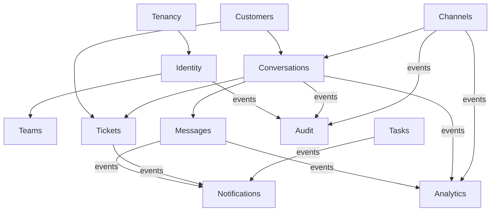

# Wasla — Domain Model

This document describes Wasla's domain-driven design: bounded contexts, aggregates,
entities, value objects, invariants, and domain events. It is the reference model that
implementation phases follow ([roadmap.md](roadmap.md)); database mapping is described
in [database.md](database.md), and event plumbing in [events.md](events.md).

---

## 1. Modeling approach

- **DDD where it pays off.** Aggregates, invariants and domain events are used where
  business rules are real (conversation lifecycle, assignment, message pipeline,
  identity resolution). Simple CRUD-ish structures (labels, settings) stay simple —
  no ceremony for ceremony's sake.
- **Aggregate rules.**
  - Aggregates are the unit of consistency; each aggregate is modified in one
    transaction and raises domain events.
  - Aggregates reference other aggregates **by ID only** (never by object reference
    across aggregates).
  - Cross-aggregate business flows are coordinated by application-level handlers and
    integration events, not by loading huge object graphs.
- **Strongly-typed IDs.** Aggregate roots use typed IDs
  (`readonly record struct ConversationId(Guid Value)`) to prevent ID mix-ups.
  All IDs are **UUIDv7** (time-ordered) for index locality.
- **Tenant ownership.** Every tenant-owned aggregate implements `ITenantOwned`
  (`TenantId TenantId { get; }`). Tenant-scoped data is never shared across tenants.
- **No anemic models.** Business rules (status transitions, assignment rules, template
  rendering constraints) live inside the domain, not in controllers or free-floating
  service classes.
- **Time is injected.** `IClock` (UTC) is a BuildingBlocks abstraction; domain code
  never calls `DateTime.UtcNow` directly.

---

## 2. Context map

Bounded contexts are the modules of the modular monolith
([architecture.md](architecture.md#5-module-catalog)). Relationships:

Arrows show dependency direction at the **contract/event** level only; no module
reaches into another module's internals (rules in
[architecture.md §6](architecture.md#6-module-boundaries-and-dependency-rules)).

---

## 3. Shared kernel concepts (BuildingBlocks)

| Concept | Purpose |
|---------|---------|
| `Entity<TId>` / `AggregateRoot<TId>` | Identity equality; aggregate root raises domain events |
| `ValueObject` | Structural equality, immutable |
| `ITenantOwned` | Marks tenant-scoped entities for filters and guards |
| `TenantId`, `UserId`, `ConversationId`, ... | Strongly-typed ID structs |
| Domain events (`IDomainEvent`) | In-process notifications raised inside a module |
| `IClock`, `ICurrentUser`, `ITenantContext` | Ambient context abstractions |
| `Result` / `Error` | Explicit success/failure for application flows |

Cross-cutting entity behaviors: `CreatedAt/UpdatedAt` audit stamps (UTC), soft delete
**only where the domain needs it** (e.g. customers, tags — not messages; see
[database.md](database.md)).

---

## 4. Tenancy module

**Aggregate: `Tenant` (root)**

| Field | Notes |
|-------|-------|
| `Id : TenantId` | UUIDv7 |
| `Name`, `Slug` | Display name + unique URL-safe slug |
| `Status` | `Active`, `Suspended`, `Closed` |
| `DefaultCulture` | e.g. `en`, `ar` (localization-ready, §51) |
| `TimeZone` | IANA id for reporting windows |
| `CreatedAt` | |

Child entities / VOs: `TenantSettings` (messaging windows, retention policy
placeholders), `TenantBranding` (later: logo, colors for future channel display).

**Invariants**

- Slug is globally unique and immutable once chosen (rename only by support).
- A `Suspended` tenant keeps data but rejects new logins and channel sends; a `Closed`
  tenant is read-only pending retention policy.
- Tenant deletion is a soft, staged process (no hard delete in MVP).

**Domain events:** `TenantCreated`, `TenantSuspended`, `TenantReactivated`.

---

## 5. Identity module

**Aggregates**

| Aggregate | Fields | Notes |
|-----------|--------|-------|
| `User` (root) | `Id`, `Email` (VO, unique globally), `DisplayName`, `PasswordHash` (nullable when OIDC-only), `Status` (`Invited`, `Active`, `Disabled`), `LastLoginAt` | A person; may belong to multiple tenants via memberships |
| `Membership` (root) | `Id`, `TenantId`, `UserId`, `Status` (`Invited`, `Active`, `Suspended`), `JoinedAt`, `RoleIds` | Binds a user into a tenant with roles |
| `Role` | `Id`, `TenantId` (nullable for system roles), `Name`, `IsSystem`, `Permissions` (set of permission codes) | Seeded: Owner, Admin, Manager, Agent, Support, Marketing, Viewer; custom roles later |
| `RefreshToken` | `Id`, `UserId`, `TenantId`, `TokenHash`, `ExpiresAt`, `RevokedAt`, `RotatedFromId` | Hashed, rotating, one-time use |

**Value objects:** `EmailAddress` (normalized), `PasswordPolicy` checks in domain
service only where criteria are business rules.

**Invariants**

- A user has at most one membership per tenant.
- Every tenant must always retain ≥ 1 active member holding the `Owner` role
  ("last owner" protection): demoting/deactivating the last owner is rejected.
- System roles cannot be deleted; permission codes are a closed catalog (typos are
  bugs), catalog defined in [security.md](security.md#3-permission-catalog).

**Domain events:** `UserRegistered`, `MembershipCreated`, `MembershipActivated`,
`RoleAssigned`, `RoleRevoked`, `RefreshTokenRotated`, `RefreshTokenReuseDetected`.

---

## 6. Teams module

**Aggregates**

| Aggregate | Fields | Notes |
|-----------|--------|-------|
| `Team` (root) | `Id`, `TenantId`, `Name`, `Description`, `Status` | Assignment target for conversations/tickets |
| `TeamMember` | `TeamId`, `UserId`, `TeamRole` (`Lead`, `Member`), `JoinedAt` | Child collection of Team |

**Invariants**

- A user may belong to a team at most once.
- A team must have at least one `Lead` while active (reassign or archive otherwise).
- Team names are unique per tenant.

**Domain events:** `TeamCreated`, `TeamMemberAdded`, `TeamMemberRemoved`, `TeamLeadChanged`.

---

## 7. Customers module (Customer 360)

**Aggregate: `Customer` (root)**

| Field | Notes |
|-------|-------|
| `Id`, `TenantId` | |
| `DisplayName` | Required; computed suggestion from identities, editable |
| `Status` | `Active`, `Archived` |
| `Notes`, `Tags`, `Activities` | Child collections (see below) |
| `CreatedAt`, `UpdatedAt` | |

**Child entities / related aggregates**

| Entity | Purpose |
|--------|---------|
| `CustomerIdentity` | A channel-specific identity: `ChannelType` (`WhatsApp`, `Telegram`, `Email`, `Phone`, `Instagram`, `Facebook`), `ExternalId` (phone in E.164, username, address), `DisplayValue`, `FirstSeenAt`, `LastSeenAt` |
| `CustomerContact` | Contact points with type + verification state: phone, email, other |
| `CustomerTag` | Link to tenant `Tag` catalog (owned by Conversations module; linked by ID) |
| `CustomerNote` | Free-text agent notes |
| `CustomerActivity` | Append-only feed of meaningful events: conversation started, order later, tag added, etc. (projection maintained from events) |

**Identity resolution rules (§9 of spec)**

- Inbound messages carry a channel identity (e.g. WhatsApp phone). Resolution order:
  1. exact match on `(TenantId, ChannelType, ExternalId)` → existing customer;
  2. optional safe linking: match on a **verified** shared contact point
     (e.g. same phone number) **only** when policy explicitly allows auto-link for that
     contact type — default is **no auto-link**;
  3. otherwise create a new customer with that single identity.
- **No automatic merging** of existing customers without safe rules. Manual merge is a
  dedicated, audited operation (Phase 9+; model supports re-pointing identities while
  preserving history).
- Uniqueness: `(TenantId, ChannelType, ExternalId)` is unique.

**Domain events:** `CustomerCreated`, `CustomerIdentityLinked`,
`CustomerIdentityResolved`, `CustomerMerged` (future), `CustomerTagAdded`,
`CustomerNoteAdded`.

---

## 8. Conversations module

**Aggregate: `Conversation` (root)**

| Field | Notes |
|-------|-------|
| `Id`, `TenantId` | |
| `CustomerId`, `ChannelId` | Logical references (IDs only) |
| `Status` | `Open`, `Pending`, `Resolved`, `Closed`, `Archived` |
| `Priority` | `Low`, `Normal`, `High`, `Urgent` |
| `AssignedUserId?`, `AssignedTeamId?` | At most one active assignee target; reassignment allowed |
| `LastMessageAt`, `LastMessagePreview` | Denormalized for inbox list |
| `UnreadCount` | For agent-facing counters |
| `FirstResponseAt?`, `ResolvedAt?`, `SlaDueAt?`, `SlaBreachedAt?` | SLA-ready timestamps (§12, §26) |
| `Tags` | `ConversationTag` child links |
| `Participants` | Users participating: agent assignments history/current; customer side implied by customer |
| `Timeline` | `ConversationTimelineEntry` projection (see below) |

**Child entities**

| Entity | Purpose |
|--------|---------|
| `ConversationTag` | Link to tenant `Tag` |
| `InternalNote` | Agent-only note; **separate type from messages** — can never be dispatched to a customer channel; supports `Mention`s |
| `Mention` | References a user or team (`@Ahmed`, `@SupportTeam`); drives notifications |
| `ConversationTimelineEntry` | Append-only activity feed: message received/sent, assigned/reassigned, tag added/removed, internal note, status changed, ticket created/closed, (future: order created, payment completed) |

**Related aggregate: `QuickReply`**

`Id`, `TenantId`, `Key` (unique per tenant, e.g. `welcome`), `Text` (template),
`AllowedVariables` (validated against a closed allowlist: `customer.name`,
`customer.phone`, `agent.name`, `tenant.name`, ...), `CreatedBy`, `UsageCount`.
Rendering uses a **safe allowlist renderer** — no expressions, no code execution (§25).

**Related aggregate: `Tag`** (the tenant tag catalog; §24)

`Id`, `TenantId`, `Key` (slug), `Name`, `Color`, `Scope` hints
(`Conversation`, `Customer`), `IsSystem` (reserved names seeded per tenant, e.g. VIP is
**not** hard-coded — tenants create their own catalog; seeds are defaults only).
Unique `(TenantId, Key)`.

**Invariants**

- **One active conversation per `(CustomerId, ChannelId)`**: inbound resolutions reuse
  an existing conversation in `Open`/`Pending`; a `Resolved`/`Closed` conversation is
  not silently reused — a new conversation is created on new inbound unless the tenant
  policy opts into "resume within X days" (config, later).
- Status transitions: `Open ⇄ Pending`, `Open → Resolved`, `Pending → Resolved`,
  `Resolved → Closed` (acknowledged), `Resolved/Closed → Archived`; reopening a
  `Resolved` conversation is allowed and audited (`Resolved → Open`), reopening
  `Closed` requires the `conversation.update` permission and is audited.
- Assignment: assigning to a user or a team clears the other target unless both
  explicitly set (team + specific agent working on behalf — allowed and tracked).
- `InternalNote` is never visible to customers; it is a distinct type — not a message
  with a flag — so it cannot leak through message-send paths.
- `UnreadCount` semantics are well-defined per audience (agent seen marker per user;
  detail in Phase 4 spec).

**Domain events:** `ConversationCreated`, `ConversationStatusChanged`,
`ConversationAssigned`, `ConversationTagged`, `ConversationUntagged`,
`InternalNoteAdded`, `MentionedInNote`, `QuickReplyUsed`.

---

## 9. Messages module

**Aggregate: `Message` (root)**

| Field | Notes |
|-------|-------|
| `Id`, `TenantId` | |
| `ConversationId`, `CustomerId?`, `ChannelId` | Logical refs |
| `Direction` | `Inbound`, `Outbound` |
| `Type` | `Text`, `Image`, `Video`, `Audio`, `Document`, `Location`, `Contact`, `Sticker`, `Template`, `Interactive`, `System` |
| `Body` | Normalized text (caption/short text); media itself never here |
| `ProviderMessageId?` | Provider's id (inbound & outbound once accepted) |
| `ProviderMetadata` | JSONB — raw provider-specific extras, **never parsed by core**; owned by adapter code, versioned |
| `Status` | `Pending`, `Sent`, `Delivered`, `Read`, `Failed` (+ failure reason code) |
| `SentAt?`, `DeliveredAt?`, `ReadAt?`, `CreatedAt` | Status timestamps |
| `IdempotencyKey?` | Client-supplied for outbound API sends |
| `Attachments` | `Attachment` children → `MediaFile` |

**Related aggregate: `MediaFile`** (metadata only; bytes live in S3-compatible storage)

`Id`, `TenantId`, `StorageKey` (`tenant/{tenantId}/...`), `FileName`, `ContentType`,
`Size`, `Hash` (SHA-256), `ScanStatus` (`Pending`, `Clean`, `Infected`, `Unknown`),
`CreatedAt` (§22).

**Invariants**

- Inbound deduplication: `(TenantId, ProviderMessageId)` unique for inbound messages —
  provider webhook replays can never create duplicate messages (§17, §58).
- Status monotonicity: `Pending → Sent → Delivered → Read`; `Failed` is terminal with
  an error code; late provider updates that regress state are ignored (idempotent
  reconciliation).
- Message body size limits enforced by validation before persistence.
- Message edits/deletes (where provider supports) are modeled as new events updating
  `ProviderMetadata` + flags — history is never silently rewritten (§49 append-only
  principles apply to audit; messages keep provider truth in metadata).

**Domain events:** `MessageReceived`, `MessageQueuedForSend`, `MessageSent`,
`MessageStatusChanged`, `MessageFailed`, `AttachmentStored`.

---

## 10. Channels module

**Aggregate: `Channel` (root)** — a tenant's configured account on a provider

| Field | Notes |
|-------|-------|
| `Id`, `TenantId` | |
| `Type` | `WhatsApp`, `Telegram`, `Instagram`, `Facebook`, `Email`, `Sms` |
| `DisplayName` | e.g. "Support line (WhatsApp)" |
| `ExternalAccountId` | Provider-side identifier (phone number id, bot id, sender address) |
| `Status` | `Draft`, `Active`, `Degraded`, `Disabled` |
| `Capabilities` | Cached capability flags refreshed on connect (templates, media, receipts) |
| `CredentialsRef` / `WebhookSecretRef` | **References** to encrypted secret material (never raw secrets in domain state; see [security.md](security.md#7-secrets-management)) |
| `ConnectedAt`, `LastHealthCheckAt` | |

**Invariants**

- Unique `(TenantId, Type, ExternalAccountId)` — one connection per provider account.
- Credentials invalid/missing ⇒ channel cannot transition to `Active`.
- Disabling a channel stops outbound sends and unregisters webhooks; data is retained.

**Domain events:** `ChannelConnected`, `ChannelVerified`, `ChannelDegraded`,
`ChannelDisconnected`.

**Adapter-facing types** (inside `Wasla.Channels.Application/Contracts`, implemented in
`Wasla.Channels.Infrastructure`): `IChannelAdapter`, `ChannelOutboundMessage`,
`ChannelSendResult`, `ChannelWebhookEnvelope`, `ChannelCapabilities`; details in
[channels.md](channels.md).

---

## 11. Tickets module

**Aggregate: `Ticket` (root)** — per §26

| Field | Notes |
|-------|-------|
| `Id`, `TenantId` | |
| `CustomerId`, `ConversationId?` | Links to 360 / inbox |
| `Title`, `Description` | |
| `Priority` | `Low`, `Normal`, `High`, `Urgent` |
| `Status` | `Open`, `InProgress`, `Pending`, `Resolved`, `Closed` |
| `AssignedUserId?`, `AssignedTeamId?` | |
| `SlaDueAt?`, `ResolvedAt?`, `ClosedAt?` | SLA-ready |
| `CreatedAt`, `UpdatedAt` | |

**Invariants:** status transitions mirror conversations; `Resolved → Closed` requires an
acknowledgement flag in the future SLA engine; assignment rules same as conversations.

**Domain events:** `TicketCreated`, `TicketAssigned`, `TicketStatusChanged`,
`TicketResolved`, `TicketClosed`.

---

## 12. Tasks module (Trello-style)

Plain, low-ceremony structures:

| Entity | Notes |
|--------|-------|
| `Board` | `Id`, `TenantId`, `Name`, `ArchivedAt?` |
| `BoardColumn` | Ordered column; ordering by fractional rank |
| `TaskCard` | Title, description, `DueAt?`, `Priority`, `Rank` (fractional index for drag/drop), links: `CustomerId?`, `ConversationId?`, `TicketId?` (optional, nullable links — **no tight coupling** §27) |
| `TaskAssignee` | Link rows |
| `TaskLabel` | Per-board labels |
| `TaskComment` | Comments with mentions (reuses Mention concept) |
| `TaskAttachment` | Links to `MediaFile` |

**Invariants:** ranks must remain orderable (rebalancing strategy documented in Phase
implementation); tasks live on exactly one column; moving columns is one transaction.

**Domain events:** `TaskCreated`, `TaskMoved`, `TaskDueSoon` (scheduled),
`TaskCompleted`, `TaskCommentAdded`.

---

## 13. Notifications module

**Aggregate: `Notification`** — `Id`, `TenantId`, `RecipientUserId`, `Type`
(e.g. `ConversationAssigned`, `Mention`, `TicketAssigned`, `TaskDue`,
`CustomerReplied`, `PaymentCompleted` (future), `CampaignCompleted` (future)),
`Payload` (typed DTO reference), `Channel` (`InApp`, `Email`, `Push` — push-ready),
`Status` (`Pending`, `Sent`, `Read`, `Failed`), `CreatedAt`, `ReadAt?`.

**Aggregate: `NotificationPreference`** — per user/tenant/type/channel toggles.

**Domain events:** `NotificationCreated`, `NotificationRead`, `NotificationDeliveryFailed`.

---

## 14. Audit module

**Aggregate: `AuditEntry`** — append-only from the application's perspective (§30):

`Id`, `TenantId`, `ActorUserId?` (null for system), `ActorType` (`User`, `System`,
`Provider`), `Action` (stable code, e.g. `conversation.assigned`), `EntityType`,
`EntityId`, `Timestamp`, `IpAddress`, `UserAgent`, `Metadata` (JSONB, redacted),
`CorrelationId`.

Rules: no update/delete API; database-level protection (revoked UPDATE/DELETE for the
application role) recorded in [database.md](database.md#8-audit--append-only-enforcement).

**Domain events:** `AuditRecorded` (rarely consumed further).

---

## 15. Analytics module (basic, MVP)

Not aggregate-centric. Built from an **event stream recorded from day one** (§36):
message/conversation events are consumed and written into compact facts:

| Structure | Purpose |
|-----------|---------|
| `analytics.AgentDailyStats` | per agent: conversations handled, messages sent, first-response and resolution aggregates |
| `analytics.ConversationFacts` | opened/resolved timestamps, channel, SLA breach flags |
| `analytics.MessageFacts` | volume by direction/channel/day |

First metrics (§36): total/open/resolved conversations, messages received/sent, first
response time, average response time, resolution time, conversations per agent, per
channel. Rollup jobs are idempotent and recompute-safe.

---

## 16. Future modules (Post-MVP — design must not preclude)

| Module | Future entities (§ of spec) | Extension points to keep open |
|--------|------------------------------|-------------------------------|
| **Campaigns** (§37) | `Campaign`, `Audience`, `Segment`, `Template`, `Schedule`, `Delivery`, `CampaignRecipient`, `CampaignEvent` | Reuses channel outbound pipeline + consent flags on CustomerContact; provider policy checks |
| **Automation** (§38) | `AutomationRule` (Trigger → Conditions → Actions), execution log | Consumes integration events; action executors as module contracts; never inside controllers |
| **Bot Builder** (§39) | `Bot`, `BotVersion` (immutable published), `BotNode`, `BotEdge`, `BotVariable`, `BotExecution`, `BotSession` | Draft/published versioning discipline; channel adapters deliver bot messages as normal messages |
| **Commerce** (§40) | `Product`, `ProductVariant`, `Order`, `OrderItem`, `Payment`, `Refund` | `IPaymentProvider` port; conversation → order links via IDs; CRM never depends on one provider |
| **Billing** (§42) | `Plan`, `Subscription`, `SubscriptionItem`, `Usage`, `Invoice`, `Payment` | Entitlements abstraction + feature flags; limits configurable, never hard-coded |
| **AI** (§41) | — (capability-oriented) | `IAiProvider` port; suggestions/summaries strictly outside domain rules |

These are documented here to freeze the boundaries now; their aggregates are designed in
their own phases when scheduled.

---

## 17. Value objects (shared)

| VO | Notes |
|----|-------|
| `EmailAddress` | Normalized (lowercased, trimmed), validated |
| `PhoneNumber` | E.164 normalized (used for WhatsApp `ExternalId`) |
| `LanguageCode` | `en`, `ar`, extensible |
| `TimeZoneId` | IANA |
| `StorageKey` | tenant-prefixed, opaque |
| `IdempotencyKey` | client- or system-generated, scoped by tenant + endpoint |
| `TemplateText` | Quick-reply template validated against allowlisted variables |
| Enums (`ConversationStatus`, `Priority`, `MessageType`, ...) | Stored as strings in DB for readability, parsed via value converters |

---

## 18. Domain events summary

Cross-aggregate event catalog (payloads, consumers and delivery guarantees are detailed
in [events.md](events.md)):

- **Tenancy:** `TenantCreated`, `TenantSuspended`, `TenantReactivated`
- **Identity:** `UserRegistered`, `MembershipCreated`, `RoleAssigned`, `RefreshTokenReuseDetected`
- **Teams:** `TeamCreated`, `TeamMemberAdded`, `TeamLeadChanged`
- **Customers:** `CustomerCreated`, `CustomerIdentityLinked`, `CustomerTagAdded`
- **Conversations:** `ConversationCreated`, `ConversationStatusChanged`, `ConversationAssigned`, `ConversationTagged`, `InternalNoteAdded`
- **Messages:** `MessageReceived`, `MessageSent`, `MessageStatusChanged`, `MessageFailed`
- **Channels:** `ChannelConnected`, `ChannelDegraded`, `ChannelDisconnected`
- **Tickets:** `TicketCreated`, `TicketStatusChanged`
- **Tasks:** `TaskCreated`, `TaskMoved`, `TaskCompleted`
- **Notifications:** `NotificationCreated`, `NotificationRead`
- **Audit:** `AuditRecorded`

Naming rule: past tense, module-prefixed in the event envelope (`customers.customer.created`).
