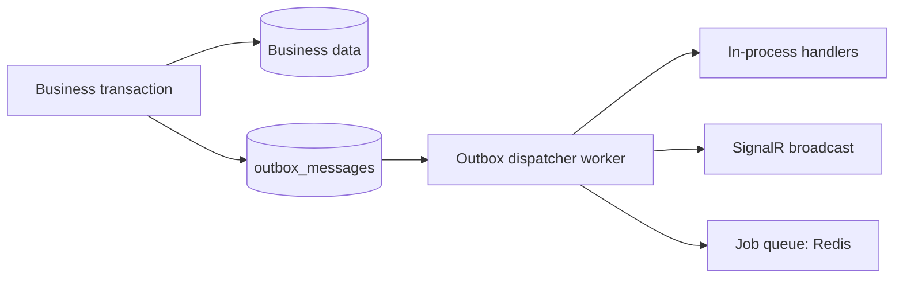

# Wasla — Events, Outbox & Inbox

This document defines how Wasla keeps modules consistent and reliable: domain events,
integration events, the Outbox pattern, the Inbox/idempotency pattern, background jobs,
and the real-time mapping. It implements §15–§18, §56–§58 of the specification.

Related: [architecture.md §6](architecture.md#6-module-boundaries-and-dependency-rules),
[webhooks.md](webhooks.md), [ADR-0004](decisions/0004-outbox-inbox-background-workers.md),
[ADR-0006](decisions/0006-signalr-tenant-scoped-realtime.md).

---

## 1. Event taxonomy

| Kind | Scope | Transport | Examples |
|------|-------|-----------|----------|
| **Domain event** | Inside one module, raised by aggregates | In-process, dispatched on `SaveChanges` of the module's `DbContext` | `Conversation.Resolved`, `Message.StatusChanged` |
| **Integration event** | Cross-module / cross-process | **Outbox table** → dispatcher → in-process handlers → (optionally) SignalR / queues | `conversations.ConversationCreated`, `messages.MessageReceived` |
| **SignalR client event** | Server → connected clients | Hub broadcast after integration event handling | `NewMessage`, `ConversationAssigned` |

Naming: `{module}.{aggregate}.{event}` in the envelope (`Type` field), e.g.
`messages.message.received`. Payload schemas are versioned (`v1`) and additive-only.

Rules:

- Event contracts are **stable**: consumers must ignore unknown fields; producers never
  repurpose a field or change its meaning.
- Events carry: `EventId`, `Type`, `Version`, `TenantId`, `OccurredAt`, `CorrelationId`,
  `CausationId` (event/command that caused it), `Payload`.
- No secrets or full message bodies in integration payloads beyond what the domain
  needs (ids + minimal denormalized fields).

---

## 2. Outbox pattern (reliability)

Problem solved: *database succeeded, queue failed* → lost side effects. Solution (§57):



- Each module writes outbox rows **in the same transaction** as business data.
- A generic dispatcher (registered per module context) claims rows with
  `FOR UPDATE SKIP LOCKED`, marks `ProcessedAt` on success, and applies retries.
- `outbox_messages`: `Id`, `TenantId`, `Type`, `Payload (jsonb)`, `DedupeKey?`,
  `OccurredAt`, `ProcessedAt?`, `Attempts`, `NextAttemptAt`, `LastError`.
- Retry policy: exponential backoff with jitter; attempt budget per event type
  (default 8, configurable); after the budget → **dead-letter** status + alert.
- Ordering: per-aggregate ordering is preserved by draining due rows in `OccurredAt`
  order per `(TenantId, AggregateId)` partition when handlers require it; handlers that
  don't require order are marked as such and may be fanned out.
- Delivery semantics: **at-least-once**. Every handler must be idempotent
  (dedupe by `EventId` when it performs external effects).

Why DB-backed dispatch (not a Redis queue as primary)? Correctness: outbox rows are
committed atomically with the data; Redis is used for *fan-out and ephemeral* work
(signals, typing, scheduled due scans), while the outbox remains the source of truth
([ADR-0003](decisions/0003-postgresql-source-of-truth-redis-cache-queues.md)).

---

## 3. Inbox pattern (provider events)

For **external** provider deliveries (webhooks), the inverse pattern applies (§58):

```text
Provider Event → inbox_events (unique) → check duplicate → process once → domain
```

- Raw events are persisted with a uniqueness constraint per provider event id (or body
  hash); duplicate deliveries short-circuit to a 2xx.
- Domain-level deduplication (e.g. unique `(TenantId, ProviderMessageId)`) makes
  processing idempotent even across replays from dead letters.
- Details: [webhooks.md](webhooks.md#4-raw-event-storage-inbox-pattern).

---

## 4. Integration event catalog (MVP)

Payloads are sketches; exact schemas are locked in Phase implementation with tests.

| Event | Publisher | Payload (sketch) | Key consumers |
|-------|-----------|------------------|----------------|
| `tenancy.tenant.created` | Tenancy | tenantId, name, slug | Identity (owner invite), Notifications |
| `identity.membership.created` | Identity | membershipId, tenantId, userId, roleIds | Audit, Notifications |
| `identity.role.assigned` | Identity | membershipId, roleIds | Audit |
| `identity.refresh_token.reuse_detected` | Identity | userId, tenantId | Security alerting, Audit, Notifications |
| `teams.team.created` | Teams | teamId, name | Audit |
| `customers.customer.created` | Customers | customerId, displayName | Analytics, Conversations (context) |
| `customers.identity.linked` | Customers | customerId, channelType, externalId | Conversations (resolution caches) |
| `channels.channel.connected` | Channels | channelId, type, accountId | Audit, Notifications, Health |
| `channels.channel.degraded` | Channels | channelId, reason | Notifications (admins), Analytics |
| `conversations.conversation.created` | Conversations | conversationId, customerId, channelId | Messages (participants), Analytics, Notifications |
| `conversations.conversation.status_changed` | Conversations | conversationId, from, to, actorUserId | Analytics, Tickets (auto-close rules later), SignalR |
| `conversations.conversation.assigned` | Conversations | conversationId, assigneeUserId?, assigneeTeamId?, actorUserId | Notifications, Analytics, SignalR, Audit |
| `conversations.conversation.tagged` | Conversations | conversationId, tagId, added | Analytics, Automation (future) |
| `conversations.note.added` | Conversations | conversationId, noteId, mentionedUserIds | Notifications (mentions) |
| `messages.message.received` | Messages | messageId, conversationId, customerId, channelId, type, preview | Conversations (counters/last message), Notifications, Analytics, SignalR |
| `messages.message.sent` | Messages | messageId, conversationId, providerMessageId | Conversations (timeline), Analytics, SignalR |
| `messages.message.status_changed` | Messages | messageId, from, to, providerTimestamp | SignalR, Analytics |
| `messages.message.failed` | Messages | messageId, reasonCode, kind | Notifications (agent), Analytics, SignalR |
| `tickets.ticket.created` | Tickets | ticketId, customerId, conversationId? | Notifications, Analytics |
| `tickets.ticket.status_changed` | Tickets | ticketId, from, to | Notifications, Analytics |
| `tasks.task.completed` | Tasks | taskId, boardId | Notifications, Analytics |
| `notifications.notification.created` | Notifications | notificationId, recipientUserId, type | SignalR |
| `audit.audit.recorded` | Audit | entryId, action, entityType, entityId | (retention/analytics) |

**Analytics note**: analytics consumes from this stream **from day one** (§36) even
before the analytics phase; facts tables are updated idempotently.

---

## 5. Background job catalog

Jobs run out-of-band (§15). Two execution sources:

1. **Outbox dispatcher** → in-process handlers (default; transactional origin).
2. **Job queue (Redis-backed)** for scheduled/periodic or fan-out work, with the same
   retry/backoff policy and dead-letter bin.

| Job | Trigger | Purpose |
|-----|---------|---------|
| `SendMessageJob` | outbox `MessageQueuedForSend` | Adapter send + status update |
| `ProcessWebhookEventJob` | inbox event worker claim | Normalize + apply inbound event |
| `DownloadProviderMediaJob` | inbound media message | Fetch media → storage → attach |
| `NotificationDispatchJob` | `NotificationCreated` | In-app row + email channel fan-out |
| `MediaScanJob` | attachment stored | Virus/malware scanning integration point |
| `SlaCheckJob` | schedule (every minute) | SLA breach flags for conversations/tickets |
| `AnalyticsRollupJob` | schedule (hourly/daily) | Recompute facts/rollups idempotently |
| `ChannelHealthCheckJob` | schedule (per channel interval) | Verify credentials/health → Degraded transitions |
| `OutboxCleanupJob` | schedule (daily) | Purge dispatched outbox rows beyond retention window |
| `TokenCleanupJob` | schedule (daily) | Purge expired refresh tokens |

Serialization: jobs carry `TenantId`; workers establish tenant context (§ multi-tenancy).

---

## 6. Real-time mapping (SignalR)

Client events (Phase 7) and their broadcast targets — always tenant-scoped groups:

| Integration event | SignalR client event | Target groups |
|--------------------|----------------------|----------------|
| `messages.message.received` | `NewMessage` | `tenant:{t}` (inbox list) + per-conversation subscribers |
| `messages.message.sent` | `NewMessage` (outbound echo) | same as above |
| `messages.message.status_changed` | `MessageStatusChanged` | `tenant:{t}:conversation:{c}` participants |
| `messages.message.failed` | `MessageStatusChanged` | same |
| `conversations.conversation.created` | `ConversationUpdated` | `tenant:{t}` |
| `conversations.conversation.status_changed` | `ConversationUpdated` | `tenant:{t}` |
| `conversations.conversation.assigned` | `ConversationAssigned` | `tenant:{t}` + `user:{assignee}` / `team:{team}` |
| `conversations.conversation.tagged` | `ConversationTagged` | `tenant:{t}` |
| `notifications.notification.created` | `NotificationCreated` | `tenant:{t}:user:{recipient}` |
| typing indicators (ephemeral, not outboxed) | `TypingStarted` / `TypingStopped` | conversation subscribers (Redis presence, TTL) |

Rule (§14): never broadcast one tenant's events to another tenant. Implementation:
hub membership derives from the token claim only; group naming is centralized in one
component with tests. Typing/presence state is Redis-backed with short TTL and never
persisted in PostgreSQL.

---

## 7. Contract stability & versioning

- Envelope `Version` starts at `1`; additive fields keep the version; breaking changes
  publish a new event type name (`...v2`) while `v1` consumers migrate.
- Consumers must tolerate: unknown fields, field order changes, newer versions of
  optional data.
- Schemas live with the publishing module (`Contracts/Events/*.cs`); a JSON schema
  export is produced for documentation (`docs/events` appendix generated later).
- Compatibility is checked by tests: domain tests assert serialized payload snapshots.

---

## 8. Operations & observability

- Outbox health: backlog count, oldest unprocessed age, failure rate — exported as
  metrics with alert thresholds.
- Dead letters: dashboard + alert; re-drive tool replays safely (idempotency).
- Correlation: `CorrelationId` flows HTTP → outbox → handlers → SignalR → logs/traces.
- Nothing that mutates domain state is ever executed synchronously inside a webhook
  request or HTTP request thread when it can be deferred (heavy work only through jobs).
