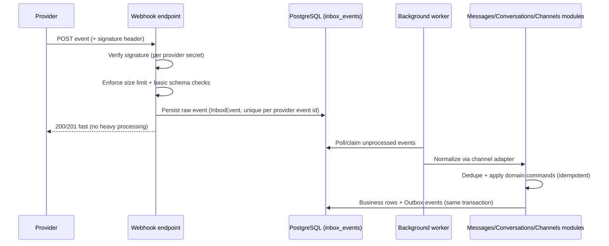

# Wasla — Webhooks

Provider webhooks are the inbound edge of the platform. They must be **fast, secure,
idempotent, and observable** (§16, §60 of the specification). This document defines the
ingress pipeline and its guarantees. Channel-specific normalization is covered in
[channels.md](channels.md); the idempotency patterns in [events.md](events.md).

---

## 1. Ingress endpoints

| Provider | Endpoint | Notes |
|----------|----------|-------|
| WhatsApp Cloud API | `GET/POST /api/v1/webhooks/whatsapp/{channelId}` | `GET` verifies subscription (`hub.challenge`); `POST` receives events |
| Telegram Bot API | `POST /api/v1/webhooks/telegram/{channelId}` | Registered via `setWebhook` with a `secret_token` |

- `{channelId}` is an **opaque, unguessable UUID** of the tenant's channel connection.
  It identifies the verification secrets and target tenant **server-side**; nothing in
  the payload is trusted for tenant resolution.
- Endpoints are anonymous at the auth layer but protected by per-channel signature
  verification (§3) and are excluded from user rate limiting (they have provider-specific
  limits instead).

## 2. Inbound pipeline

**Fast path rules**

- No heavy work before the 2xx response: signature check + size check + raw persist only.
- Target handling time: **p95 < 200 ms** (measured; alert if breached).
- Request body limit: **256 KB default** per provider (configurable per provider;
  `413` beyond it).
- Unknown/unparseable-but-signed payloads are still persisted as raw events for
  forensics, then marked `Skipped` by the processor if not actionable.

## 3. Signature verification

| Provider | Mechanism |
|----------|-----------|
| WhatsApp Cloud API | `X-Hub-Signature-256: sha256=<hmac>` — HMAC-SHA256 of the **raw body** with the app secret; constant-time comparison. Subscription verification uses `hub.verify_token` on `GET`. |
| Telegram Bot API | `X-Telegram-Bot-Api-Secret-Token` header must equal the secret configured at `setWebhook`; comparison is constant-time. |

Rules:

- Verification happens **before** anything else (except size limiting).
- Secrets are stored as encrypted references on the `Channel` entity, resolved at
  request time; rotations are per-channel configuration (documented procedure:
  set new secret, re-verify, revoke old).
- Failed verification: `401`/`403`, an audit/log entry (redacted), a metric increment,
  and **no** payload persistence of the body beyond a hash.
- Replay protection: signature + (where the provider supports it) timestamp windows.
  WhatsApp does not sign timestamps, so replay is neutralized by **idempotent
  processing** (below); Telegram replays are bounded by secret + dedupe.

## 4. Raw event storage (Inbox pattern)

`channels.inbox_events`:

| Column | Notes |
|--------|-------|
| `Id` | UUIDv7 |
| `TenantId`, `ChannelId` | Resolved server-side |
| `Provider` | `WhatsApp` / `Telegram` |
| `ExternalEventId` | Provider event/message id when present |
| `Payload` | `jsonb` raw body (retention-bound; never logged verbatim) |
| `HeadersFingerprint`, `BodyHash` | For dedupe when no reliable event id exists |
| `SignatureValid` | Boolean (only persisted rows passing validation) |
| `ReceivedAt`, `ProcessedAt`, `Status`, `LastError`, `Attempts` | Processing state |

**Uniqueness**: `(ChannelId, ExternalEventId)` when an event id exists; otherwise
`(ChannelId, BodyHash)` within a short time window. Duplicate delivery therefore
inserts are no-ops (fast conflict path) — the provider still receives a 2xx.

## 5. Idempotent processing

Provider events **may arrive more than once** (§15, §17). The pipeline is idempotent at
two levels:

1. **Event level** — the unique row above; a duplicate webhook never enqueues a second
   processing job.
2. **Domain level** — normalization results carry `ProviderMessageId`; message inserts
   are protected by the partial unique index `(TenantId, ProviderMessageId)`
   ([database.md](database.md#4-constraints)). Status updates are **monotonic** and
   idempotent (late/duplicated updates cannot regress a message status).

Delivery semantics: **at-least-once processing with effectively-once effects** for the
domain (insert-if-absent + monotonic updates), which is the strongest honest guarantee
without provider-side exactly-once support.

## 6. Processing workers and failure handling

- Workers claim events in batches (`FOR UPDATE SKIP LOCKED` semantics via EF/raw claim
  query in the Channels infrastructure — the one sanctioned system query).
- Per-event processing is a unit of work: normalize → resolve context → invoke module
  commands → mark processed. Business writes and outbox rows commit together.
- Failures: exponential backoff retries (attempt budget per event), then **dead-letter**
  status with alerting; a re-drive tool can replay dead letters (safe by idempotency).
- Ordering: per-conversation ordering is preserved by processing per
  `(ChannelId, provider ordering key)` when the provider supplies ordering (Telegram
  update ids); otherwise the domain tolerates out-of-order arrival (timestamps come
  from the provider payload).

## 7. Observability

Metrics (per provider/channel): received, rejected (signature), processing duration,
processed, failed, dead-lettered, backlog age. Traces continue across the queue boundary
(correlation id stored on the inbox row). Logs are structured and **redacted**: message
content is never logged at info level; only ids, types, and sizes.

Alerts: backlog age > threshold, failure rate spike, signature-failure spike (possible
misconfiguration or attack), dead-letter growth.

## 8. Security checklist (§60)

- [x] Signature validation per provider (constant-time compare)
- [x] Timestamp/replay protection (where provider supports; otherwise dedupe-based)
- [x] Idempotency (event + domain level)
- [x] Request size limits
- [x] Redacted logging (no full payloads in logs)
- [x] No trust in payload for tenant resolution (server-side from `channelId`)
- [x] Rate limiting at the edge with provider-appropriate thresholds
- [x] Secrets per channel, encrypted at rest, rotatable
- [x] Endpoints excluded from CSRF (no cookie auth) and included in security review

## 9. Operations

- **Registration**: Telegram webhooks are registered/unregistered automatically by the
  channel connect/disconnect flow; WhatsApp webhook URLs are configured in the Meta app
  console (documented in deployment runbook) and verified once per environment.
- **Environment switch**: each environment (dev/staging/prod) has its own provider
  apps/bots and secrets; production secrets never appear outside the secret store.
- **Local development**: providers support tunneling/development endpoints; local runs
  use per-developer provider sandbox apps where available, or a replay fixture harness
  that posts recorded (anonymized) payloads to the endpoints in integration tests.
